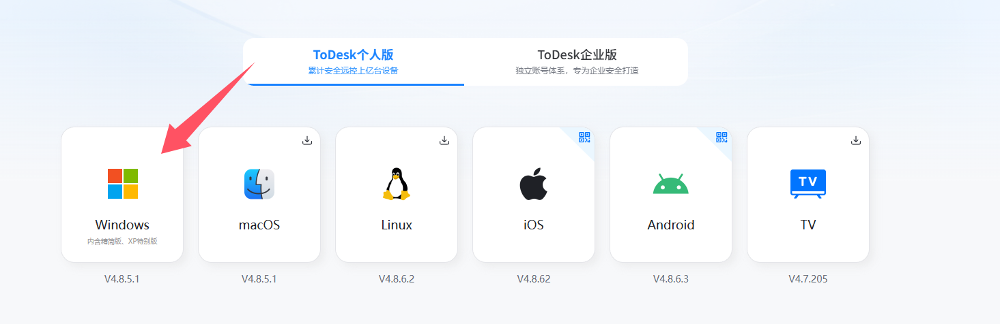
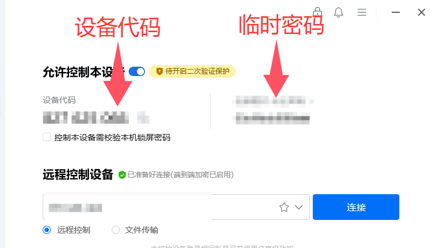

如果需要客服远程操作电脑，可以用 ToDesk 最快最方便。按下面的教程来，两分钟就能搞定。

## 第一步：下载安装

1. 打开浏览器，访问 ToDesk 官网：[www.todesk.com](https://www.todesk.com/download.html)

1. 点击“立即下载”，下载 Windows 版本（其他系统选对应版本）。
   

1. 双击安装包，一路点“下一步”完成安装。桌面会出现 ToDesk 图标。

> 安装时如果有安全提示，选“允许”就行。

## 第二步：打开软件，提供信息

1. 双击 ToDesk 图标启动软件。

1. 主界面上你会看到两串信息：

1. 设备代码（9位数字）

1. 临时密码（字母+数字，区分大小写）

1. 把这两个号码发给客服、

   

## 第三步：同意远程连接

1.  客服发起连接后，屏幕会弹出一个窗口，询问是否允许我控制。

1.  点击 “允许”。

1.  如果弹出“用户账户控制”提示，点 “是”。

1.  整个过程你都能看到屏幕，随时可以移动鼠标中断控制。
    客服处理完后会自动断开，你也可以直接关闭 ToDesk 窗口结束连接。

## 使用提示

- 密码用完就失效：每次启动软件都会生成新密码，不用担心泄露。

- 用完可退出软件：如果不再需要远程，右键点托盘图标选“退出”就行。

- 连接卡顿怎么办：检查网络，关闭其他占用网速的程序。

- 看不到代码：稍等几秒，或者检查防火墙是否拦截了 ToDesk。
